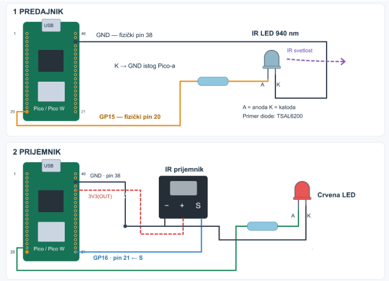
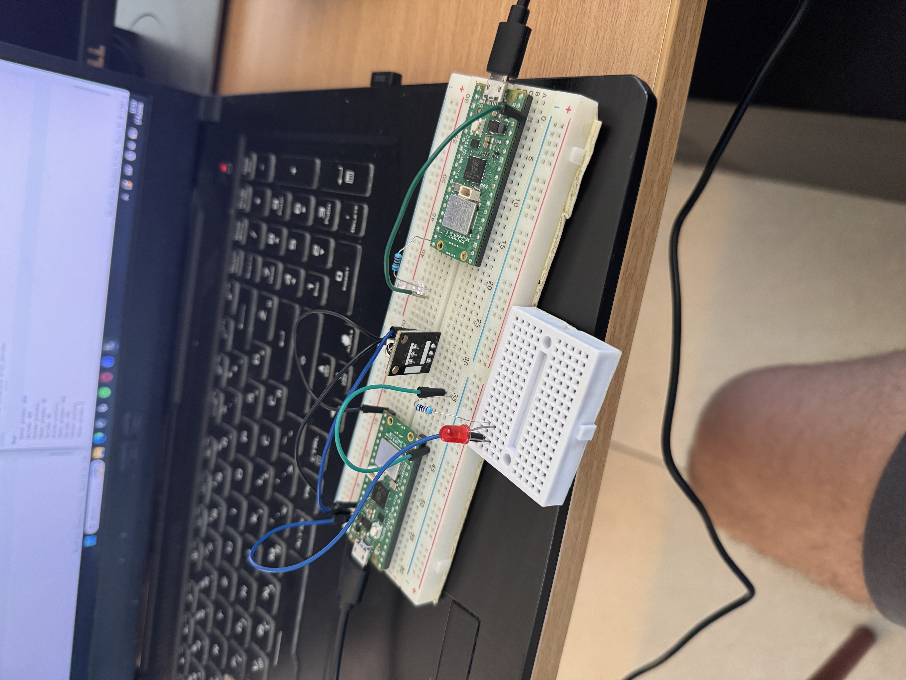
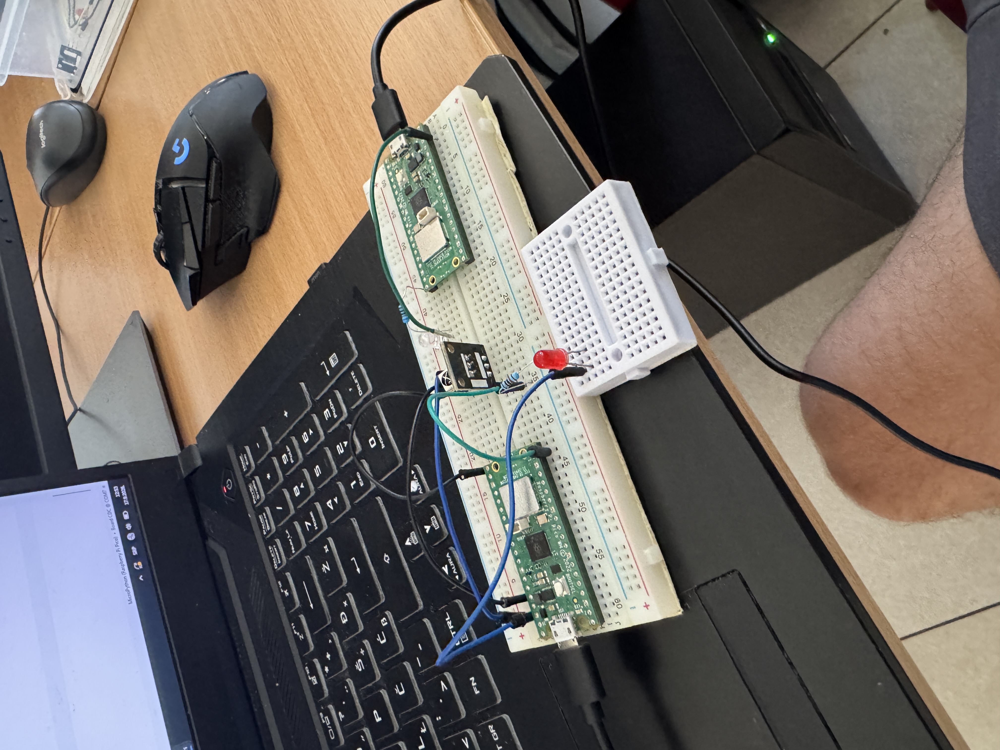
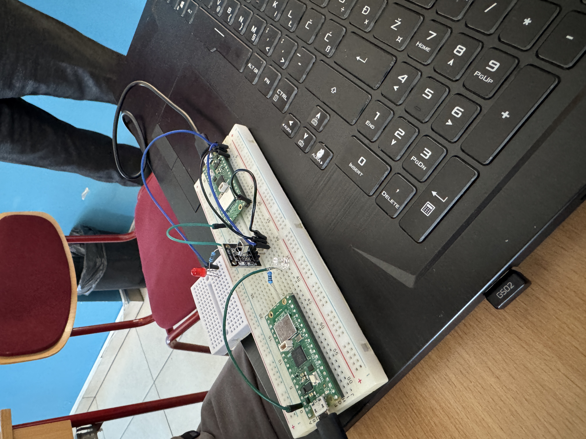

# Raspberry Pi Pico IR Communication

A simple infrared communication project built with two Raspberry Pi Pico / Pico W microcontrollers and MicroPython.

One Pico works as the **IR transmitter**, while the other works as the **IR receiver**. Text entered on the transmitter is sent byte-by-byte using a 38 kHz infrared carrier. The receiver reconstructs the message and then displays it as Morse code using an LED.

## Features

- 38 kHz IR transmission using PWM
- Byte-by-byte text communication
- Custom pulse timing for binary `0` and `1`
- End-of-message marker
- Message reconstruction on the receiver
- Morse-code output using an LED

## How it works

### Transmitter

The transmitter uses PWM on **GP15** at **38 kHz**.

Each byte starts with:

- 4 ms IR burst
- 4 ms pause

The 8 data bits are then sent least-significant bit first.

For every bit:

- `0` -> 600 us burst + 600 us pause
- `1` -> 600 us burst + 1600 us pause

After the text is sent, byte value `10` is used as the end-of-message marker.

### Receiver

The receiver reads the IR signal on **GP16** and measures pulse lengths with `time_pulse_us()`.

A pause longer than approximately 1100 us is interpreted as binary `1`; shorter pauses are interpreted as binary `0`.

Received printable ASCII characters are collected into a message. When the end marker is received, the complete message is printed and converted to Morse code.

The Morse code is shown using an LED connected to **GP14**.

## Project structure

```text
pico-ir-communication/
├── README.md
├── transmitter/
│   └── main.py
├── receiver/
│   └── main.py
└── docs/
    └── wiring-diagram.png
```

## Hardware

The project uses:

- 2 × Raspberry Pi Pico / Pico W
- IR LED transmitter
- IR receiver module
- Red LED
- Resistors
- Breadboard and jumper wires
- USB connections for programming and serial communication

## Wiring

The wiring diagram used for the project is available below:



## Project photos

### Overview


### Setup


### Another angle


## Running the project

1. Copy `transmitter/main.py` to the transmitting Pico.
2. Copy `receiver/main.py` to the receiving Pico.
3. Connect the components according to the wiring diagram.
4. Run both programs.
5. Enter a message in the transmitter console.
6. The receiver prints the received text and then outputs it as Morse code through the LED.

## Technologies

- MicroPython
- Raspberry Pi Pico / Pico W
- PWM
- GPIO
- Infrared communication
- Morse code

## Author

**Andrija Mitrović**  
Computer Engineering student at Računarski fakultet (RAF), Belgrade.
